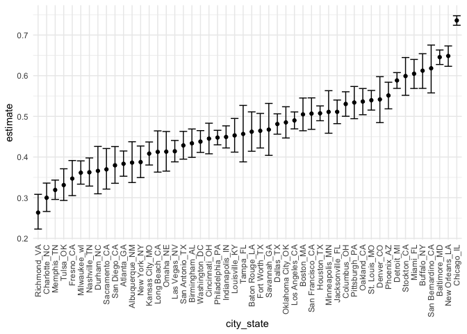
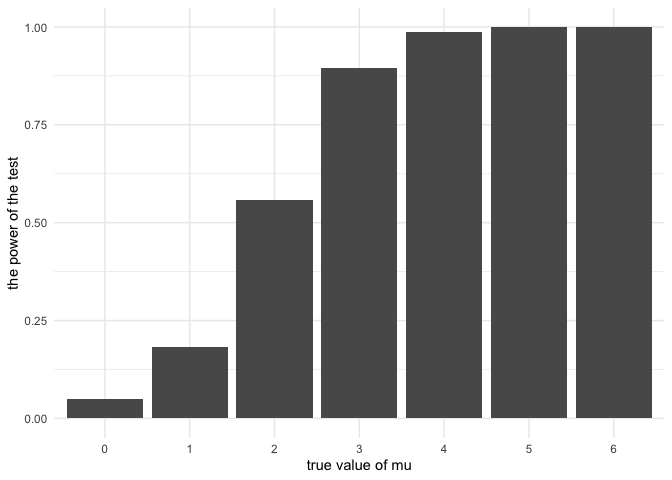
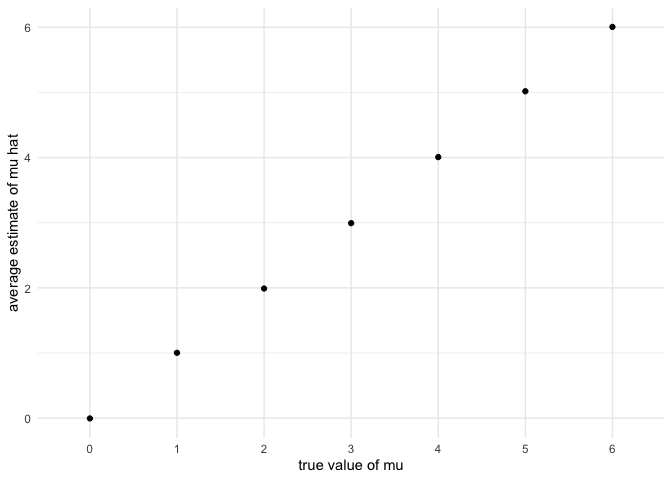

hw5
================
Yutian Luo
11/10/2020

# `Problem 1`

The Washington Post has gathered data on homicides in 50 large U.S.
cities and made the data available through a GitHub repository here. You
can read their accompanying article here.

``` r
homi_data = 
  read.csv(file = "./data/homicide-data.csv")
```

Describe the raw data. Create a city\_state variable (e.g. “Baltimore,
MD”) and then summarize within cities to obtain the total number of
homicides and the number of unsolved homicides (those for which the
disposition is “Closed without arrest” or “Open/No arrest”).

A:

The dataset has 12 variables and 52179 rows. The importat variables
include uid, reported\_date, victim\_last, victim\_first, victim\_race,
victim\_age, victim\_sex, city, state, lat, lon, disposition.

``` r
# create city_state var
homi_data = 
  homi_data %>% 
  mutate(
    city_state = paste(city, ",",  state)
  ) 

# summaries
df1 = 
  homi_data %>% 
  group_by(city_state) %>% 
  summarise(total_homi = n())%>%
  arrange(desc(total_homi))
```

    ## `summarise()` ungrouping output (override with `.groups` argument)

``` r
df2 = 
  homi_data %>% 
  filter(disposition %in%  c("Closed without arrest", "Open/No arrest")) %>% 
  group_by(city_state) %>% 
  summarise(num_unsolved = n()) %>% 
  arrange(desc(num_unsolved))
```

    ## `summarise()` ungrouping output (override with `.groups` argument)

``` r
homi_city = 
full_join(df1, df2, by = "city_state")
```

For the city of Baltimore, MD, use the prop.test function to estimate
the proportion of homicides that are unsolved; save the output of
prop.test as an R object, apply the broom::tidy to this object and pull
the estimated proportion and confidence intervals from the resulting
tidy dataframe.

``` r
df_bal =
  homi_city %>% 
  filter(city_state ==  "Baltimore , MD") 

# store baltimore in tibble
lis_col_bal = 
  tibble(
    total = df_bal[[2]],
    unsolve = df_bal[[3]]
  )

# prop test
lis_col_balprop = 
      prop.test(x=lis_col_bal$unsolve, 
            n=lis_col_bal$total, 
            p = 0.5, 
            alternative = "two.sided", 
            conf.level = 0.95, 
            correct = TRUE) %>% 
      broom::tidy() 


# pull estimator and CI
lis_col_balprop %>% pull(estimate)
```

    ##         p 
    ## 0.6455607

``` r
lis_col_balprop %>% pull(conf.low)
```

    ## [1] 0.6275625

``` r
lis_col_balprop %>% pull(conf.high)
```

    ## [1] 0.6631599

Now run prop.test for each of the cities in your dataset, and extract
both the proportion of unsolved homicides and the confidence interval
for each. Do this within a “tidy” pipeline, making use of purrr::map,
purrr::map2, list columns and unnest as necessary to create a tidy
dataframe with estimated proportions and CIs for each city.

``` r
lis_col_allcity = 
  tibble(
    total = homi_city[[2]],
    unsolve = homi_city[[3]]
  )

# purrr::map2(.x = lis_col_allcity$unsolve,
#      .y = lis_col_allcity$total,
#      ~ prop.test(.x, .y))
```

Answer:

``` r
homicide_df =
  read_csv("./data/homicide-data.csv") %>%
  mutate(
    city_state = str_c(city, state, sep = "_"),
    resolved = case_when(
      disposition == "Closed without arrest" ~ "unsolved",
      disposition == "Open/No arrest" ~ "unsolved",
      disposition == "Closed by arrest" ~ "solved",
    )
  ) %>%
  select(city_state, resolved) %>%
  filter(city_state != "Tulsa_AL")
```

    ## Parsed with column specification:
    ## cols(
    ##   uid = col_character(),
    ##   reported_date = col_double(),
    ##   victim_last = col_character(),
    ##   victim_first = col_character(),
    ##   victim_race = col_character(),
    ##   victim_age = col_character(),
    ##   victim_sex = col_character(),
    ##   city = col_character(),
    ##   state = col_character(),
    ##   lat = col_double(),
    ##   lon = col_double(),
    ##   disposition = col_character()
    ## )

``` r
aggregate_df =
  homicide_df %>%
  group_by(city_state) %>%
  summarise(
    hom_total = n(),
    hom_unsolved = sum(resolved == "unsolved")
  )
```

    ## `summarise()` ungrouping output (override with `.groups` argument)

``` r
prop.test(
  aggregate_df %>% filter(city_state == "Baltimore_MD") %>% pull(hom_unsolved),
  aggregate_df %>% filter(city_state == "Baltimore_MD") %>% pull(hom_total)) %>%
  broom:: tidy()
```

    ## # A tibble: 1 x 8
    ##   estimate statistic  p.value parameter conf.low conf.high method    alternative
    ##      <dbl>     <dbl>    <dbl>     <int>    <dbl>     <dbl> <chr>     <chr>      
    ## 1    0.646      239. 6.46e-54         1    0.628     0.663 1-sample… two.sided

``` r
results_df = 
  aggregate_df %>%
  mutate(
    prop_tests = map2(.x = hom_unsolved, .y = hom_total, ~prop.test(x = .x, n = .y)),
    tidy_tests = map(.x = prop_tests, ~broom::tidy(.x))
  ) %>%
  select(-prop_tests) %>%
  unnest(tidy_tests) %>%
  select(city_state, estimate, conf.low, conf.high)
```

``` r
results_df %>%
  mutate(city_state = fct_reorder(city_state,estimate)) %>%
  ggplot(aes(x = city_state, y =estimate)) +
  geom_point() +
  geom_errorbar(aes(ymin = conf.low, ymax = conf.high)) +
  theme(axis.text.x = element_text(angle =90, vjust = 0.5, hjust = 1))
```

<!-- -->

# `Problem 2`

Create a tidy dataframe containing data from all participants, including
the subject ID, arm, and observations over time:

Start with a dataframe containing all file names; the list.files
function will help Iterate over file names and read in data for each
subject using purrr::map and saving the result as a new variable in the
dataframe Tidy the result; manipulate file names to include control arm
and subject ID, make sure weekly observations are “tidy”, and do any
other tidying that’s necessary

Make a spaghetti plot showing observations on each subject over time,
and comment on differences between groups.

``` r
exp_plot = 
  exp_df %>% 
  pivot_longer(
    cols = week_1:week_8,
    names_to = "weeks",
    values_to = "vals"
  ) %>% 

  ggplot(aes(x = weeks, y = vals, group = subject_id, color = con_arm)) +
  geom_line()

exp_plot
```

<!-- -->

A:

At the start of the experiment, both groups are having similar values.
For the experimental arm, as week time progress, the values are rising
faster than the control arm. The experimental arm remains in a stable
value inetrval during the 8 weeks.

# Problem 3

When designing an experiment or analysis, a common question is whether
it is likely that a true effect will be detected – put differently,
whether a false null hypothesis will be rejected. The probability that a
false null hypothesis is rejected is referred to as power, and it
depends on several factors, including: the sample size; the effect size;
and the error variance. In this problem, you will conduct a simulation
to explore power in a one-sample t-test.

First set the following design elements:

Fix n=30 Fix σ=5 Set μ=0 Generate 5000 datasets from the model

For each dataset, save μ̂ and the p-value arising from a test of H:μ=0
using α=0.05 . Hint: to obtain the estimate and p-value, use broom::tidy
to clean the output of t.test.

``` r
set.seed(1)

n = 30
sigma = 5
mu = 0

gen_norm = function(n, mu, sigma){
  tibble(
      rnorm(n = n, mean = mu, sd = sigma)
  )
}

resnorm_df = vector("list", 5000) 
for (i in 1:5000) {
     resnorm_df[i] = gen_norm(n, mu, sigma)
}

# compute mean and pvals
mu_pval = function(x){
  mean_x = t.test(x)$estimate
  pval_x = t.test(x)$p.value
  
  tibble(
    mean = mean_x,
    pval = pval_x
  )
}

# save mu and pval for each dataset
resnorm_mupval = map(resnorm_df, mu_pval)
```

Repeat the above for μ={1,2,3,4,5,6}, and complete the following:

``` r
# mu_list = 
#   list(
#     "mu_0" = 0,
#     "mu_1" = 1,
#     "mu_2" = 2,
#     "mu_3" = 3,
#     "mu_4" = 4,
#     "mu_5" = 5,
#     "mu_6" = 6
#   )
# 
# res_mu_all_df = vector("list", length = 7)
# 
# for(i in 1:7){
#   res_mu_all_df[[i]] = purrr::rerun(5000, gen_norm(n, mu_list[[i]], sigma))
# }
# 
# #??????????????????????????????
# for(i in 1:7){
#   res_mu_all_df[[i]] = mu_pval(res_mu_all_df[[i]])
# }
```

``` r
# function for t test
sim_t_test = function(mu , n = 30, sd = 5) {
  sim_data = 
    tibble(
      broom::tidy(t.test(rnorm(n = n, mean = mu, sd = sd)))
    ) %>%
    select(c(estimate, p.value))
  sim_data
}

# result df for mu(0...6)
sim_res = 
  tibble(
    mu = c(0,1,2,3,4,5,6)
  ) %>% 
  mutate(
    output_lists = map(.x = mu, ~ rerun(5000, sim_t_test(.x))),
    estimate_df = map(output_lists, bind_rows)
  ) %>% 
  select(-output_lists) %>% 
  unnest(estimate_df)
```

Make a plot showing the proportion of times the null was rejected (the
power of the test) on the y axis and the true value of μ on the x axis.

``` r
# ggplot 
sim_res_plot_1 =
  sim_res %>%
  filter(p.value < 0.05) %>%
  group_by(mu) %>%
  summarise(power = n()/5000) %>%
  transform(mu = as.factor(mu)) %>%
  ggplot(aes(mu, power)) +
  geom_bar(stat='identity') +
  ylab("the power of the test" ) +
  xlab("true value of mu")
```

    ## `summarise()` ungrouping output (override with `.groups` argument)

``` r
sim_res_plot_1
```

<!-- -->

Describe the association between effect size and power. Make a plot
showing the average estimate of μ̂ on the y axis and the true value of μ
on the x axis.

``` r
sim_res_plot_2 =
  sim_res %>%
  group_by(mu) %>%
  summarise(avg_estimate = mean(estimate))  %>%
  transform(mu = as.factor(mu)) %>% 
  ggplot(aes(mu, avg_estimate)) +
  geom_point(stat='identity') +
  ylab("average estimate of mu hat" ) +
  xlab("true value of mu")
```

    ## `summarise()` ungrouping output (override with `.groups` argument)

``` r
sim_res_plot_2
```

<!-- -->

Make a second plot (or overlay on the first) the average estimate of μ̂
only in samples for which the null was rejected on the y axis and the
true value of μ on the x axis.

``` r
sim_results_plot_3 =
  sim_res %>%
  filter(p.value < 0.05) %>%
  group_by(mu) %>%
  summarise(avg_estimate = mean(estimate)) %>%
  transform(mu = as.factor(mu)) %>% 
  ggplot(aes(mu, avg_estimate)) +
  geom_point(stat='identity') +
  ylab("average estimate of mu hat" ) +
  xlab("true value of mu")
```

    ## `summarise()` ungrouping output (override with `.groups` argument)

``` r
sim_results_plot_3
```

<!-- -->

Is the sample average of μ̂ across tests for which the null is rejected
approximately equal to the true value of μ? Why or why not?
